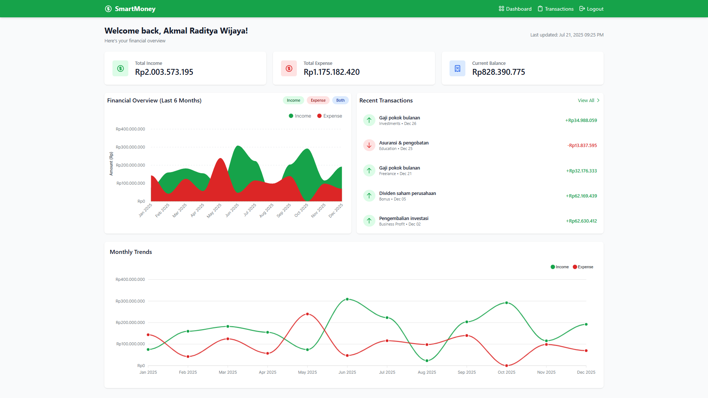

# 💰 SmartMoney - Aplikasi Manajemen Keuangan Pribadi



## 💼 Aplikasi Manajemen Keuangan Pribadi

Aplikasi manajemen keuangan berbasis web yang dibangun dengan teknologi modern seperti Laravel, Tailwind CSS, MySQL, dan ApexCharts.js.
Membantu pengguna untuk melacak pemasukan dan pengeluaran secara efisien dengan visualisasi data yang interaktif dan responsif.

---
[](https://skillicons.dev)


## ✨ Fitur Utama

### ✅ Manajemen Transaksi
- Tambah, edit, dan hapus transaksi
- Kategorisasi transaksi (pemasukan/pengeluaran)
- Pencarian dan filter transaksi

### ✅ Dashboard Interaktif
- Visualisasi data dengan ApexCharts.js
- Grafik pemasukan dan pengeluaran
- Ringkasan keuangan bulanan

### ✅ Autentikasi Pengguna
- Registrasi dan login manual
- Proteksi halaman dengan middleware

### ✅ Tema Modern
- Desain responsif dengan Tailwind CSS
- Tema warna hijau yang konsisten
- Animasi dan transisi halus

### ✅ Notifikasi
- SweetAlert untuk notifikasi interaktif
- Konfirmasi sebelum penghapusan

---

## 🧰 Teknologi yang Digunakan

- **Backend:** Laravel 10
- **Frontend:** Tailwind CSS 3, ApexCharts.js
- **Database:** MySQL
- **Autentikasi:** Laravel Sanctum
- **Notifikasi:** SweetAlert2

---

## 🖥️ Persyaratan Sistem

- PHP 8.1+
- Composer 2.0+
- Node.js 16+
- MySQL 5.7+
- NPM 8+

---

## 🚀 Instalasi

### 1. Clone repository:

```bash
git clone https://github.com/username/financial-app.git
cd financial-app
```
### 2. Install dependencies:

```bash
composer install
npm install
```

### 3. Buat file .env:

```bash
cp .env.example .env
```

### 4. Generate key aplikasi:

```bash
php artisan key:generate
```

### 5. Konfigurasi database di .env:

```ini
DB_CONNECTION=mysql
DB_HOST=127.0.0.1
DB_PORT=3306
DB_DATABASE=financial_app
DB_USERNAME=root
DB_PASSWORD=
```

### 6. Jalankan migrasi dan seeder:

```bash
php artisan migrate --seed
```

### 7. Compile assets:

```bash
npm run dev
```

### 8. Jalankan server lokal:

```bash
php artisan serve
```

---

## 🗂️ Struktur Proyek

```php
financial-app/
├── app/               # Logika aplikasi Laravel
├── config/            # Konfigurasi aplikasi
├── database/          # Migrasi dan seeder
├── public/            # Aset publik
├── resources/         # View dan aset frontend
│   ├── js/            # JavaScript
│   ├── css/           # Stylesheet
│   └── views/         # Blade templates
├── routes/            # Route aplikasi
├── tests/             # Unit testing
└── vendor/            # Dependencies Composer
```
